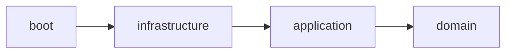

# flowrapp_backend

## Getting Started

### Dependencies

This project uses Docker Compose for managing local dependencies. Make sure you have Docker and Docker Compose installed on your system.

### Installation

1. Clone the repository:
   ```bash
   git clone https://github.com/flowraapp/flowrapp_backend.git
   cd wsc-peopleidentity
   ```

2. **Important**: When cloning the repository for the first time, you need to create your environment configuration file:
   ```bash
   cp boot/src/test/resources/compose/.env.template boot/src/test/resources/compose/.env
   ```

3. Edit the `.env` file with appropriate values for your environment:
   ```bash
   nano boot/src/test/resources/compose/.env
   ```

### Execution

```bash
cd code
mvn docker-compose:up
mvn clean install
cd boot
mvn spring-boot:run
```

### Configuration

The Docker environment configuration is managed through the `.env` file located at `boot/src/test/resources/compose/.env`. This file contains environment variables that configure the Docker services. Make sure you've properly configured this file before starting the services with `mvn docker-compose:up`.

## Hexagonal Structures

This project structure is intended to split the application in 3 main parts, business logic, technology and configuration.

- **Business logic**: this _module_ represents the core logic of this project, its goal is to be technology-agnostic focusing solely on solving business problems. This _module_ should be named `domain`. There are usually 3 main _packages_ within this realm.
    - **Model**, represents the problem using entities as well as modeling their business exceptions. It usually contains the data as well as the entities relations.
    - **Ports**, represents connection points with the technology layer, they are separated between _input_ and _output_ ports.
        - **Input** ports are the use cases the domains offers to the exterior.
        - **Output** ports are connections to any outsider from the application.
    - **Application**, contains the use case implementations and orchestrates the application flow.

  This is a clarification list of dependencies allowed in this _module_.
    - It can import any technology libraries to represent state this includes: advanced collections, functional utilities, error management, code generation, graph, logging, etc.
    - It Should avoid external communications libraries like serialization, network, database, etc.
    - It can import libraries to handle control flow, transactionality, etc. Those are going to be used directly in the Application _package_.


- **Technology**:  implements the output ports and allows outsiders to access the in ports by implementing adapters of those interfaces with the chosen technology stack. This module should be named `infrastructure` and should have different _packages_ for the `input` and `output` ports. If the language possibilities constraints on imports, code withing this module shouldn't be accessible from `domain` module.

- **Configuration**: this layer defines the application's configuration as code and serves as the entry point if required by the chosen framework. This module should be named `boot`. Code from `infrastructure` and `domain` shouldn't be accessible from `boot`.

This is how the dependencies among modules would look like.


